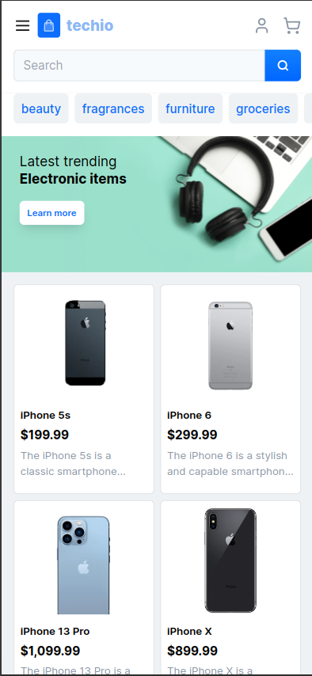
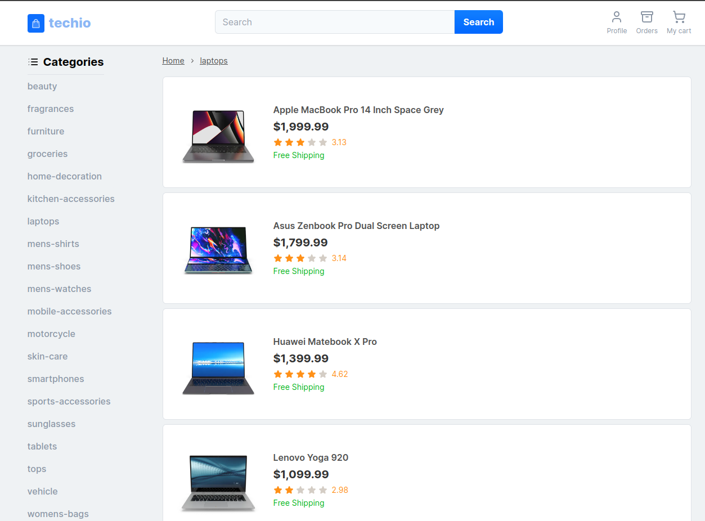

# Techio (E-commerce App)

Uma aplicação de e-commerce fictícia que oferece uma variedade de produtos.  


## Demonstração


## Screenshots

<p float="left">
    
    
</p>

<p float="left">
  
  
</p>
## Rodando localmente

Clone o projeto

```bash
  git clone https://github.com/ThiagoBarbosa05/techio.git
```

Entre no diretório do projeto

```bash
  cd techio
```

Instale as dependências

```bash
  npm install
```

Inicie o servidor

```bash
  npm run dev
```


## Variáveis de Ambiente

Para rodar esse projeto, você vai precisar adicionar as seguintes variáveis de ambiente no seu .env

`SESSION_SECRET`

`DATABASE_URL` -> mongodb URL


## Funcionalidades

- Gerenciamento do carrinho de compras do usúario
- Autenticação
- Responsividade


## Aprendizados

- Armazenamento de dados utilizando MongoDB e Mongoose
- Next.js 14
- Server Actions
- Novas Features do React 19 - (useTransaction e useActionState)

## Referência

 - [Shadcn](https://awesomeopensource.com/project/elangosundar/awesome-README-templates)
 - [DummyJON - Products Api](https://dummyjson.com/)
 - [Next.js](https://nextjs.org/)
 - [Mongoose](https://mongoosejs.com/)
 - [MongoDB](https://www.mongodb.com/)


## Autores

- [@ThiagoBarbosa05](https://github.com/ThiagoBarbosa05)

